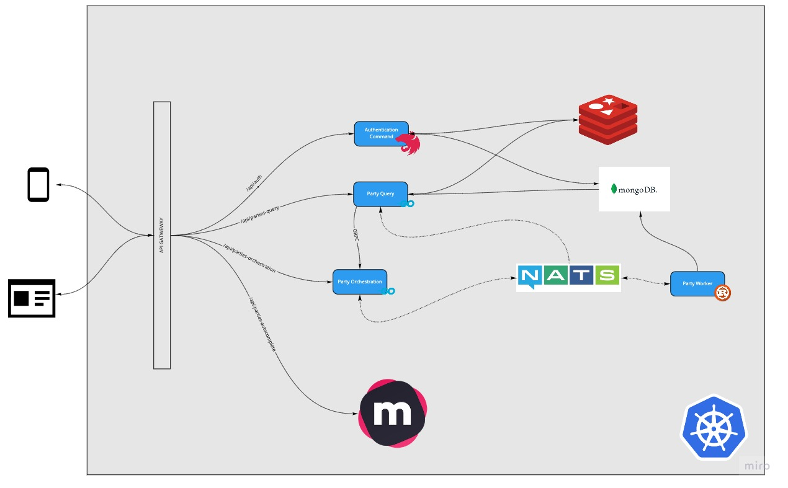

# Microservices Example


You can explore all availiable apis postman collection in docs/ 


## Installation
- docker compose up -d --build
- open browser localhost
- Want to try autocomplete ? goto localhost:7700

## Disclaimer
I have to time to done my frontend and docs but the simple features are work fine.


## Data-Models

### Nats

### MongoDB

#### authentication database

```json
// auth collection
{
 "email": "String",
 "password:"String"
}
```

#### party database
```json
// party collection
{
 "name": "String",
 "image_path":"String",
 "description:"String"
 "seat_limit":Number
 "seat":Number
}
```


### Redis

```json
// auth cache
[{token}]: email 
```

```json
// party cache
[PARTY_{party_id}] : {
 "name": "String",
 "image_path":"String",
 "description:"String"
 "seat_limit":Number
 "seat":Number
}
```

### MelliSearch
```json
{
    title: String(party name)
    desc: String(party description)
}
```
